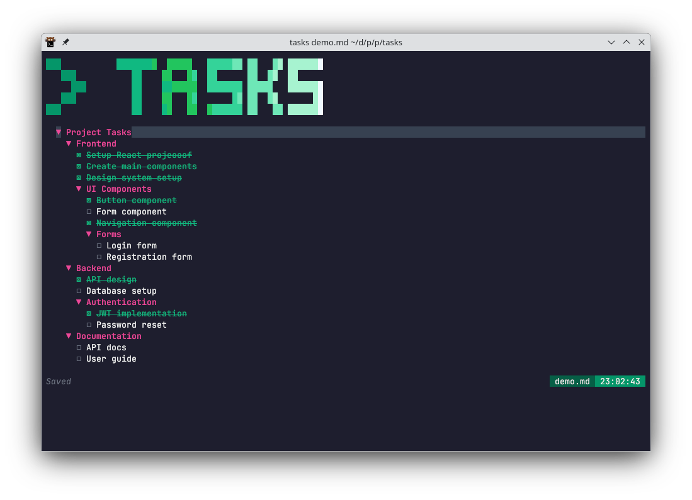

# Tasks - Terminal Markdown Task Manager

A beautiful, interactive terminal application for managing tasks stored in markdown files. Built with Go, Bubble Tea, and lipgloss for a modern TUI experience.



## Features

- ✨ **Interactive Terminal UI** - Navigate with Vim-style keys
- 📋 **Markdown Integration** - Works with standard markdown task lists
- 🌳 **Hierarchical Structure** - Support for nested sections and tasks
- 🎨 **Beautiful Styling** - Modern colors, typography, and consistent highlighting
- ⚡ **Live Editing** - Create and edit tasks and sections in-place
- 🔄 **Task Management** - Toggle completion, move tasks, collapse sections
- 🎯 **Section Creation** - Quick section creation with h+1 to h+6 shortcuts
- ✨ **Smart Highlighting** - Fixed-width highlighting that adapts to indentation

## Installation

### Prerequisites
- Go 1.24.5 or later

### Install with Go
```bash
go install dev.rischmann.fr/tasks@latest
```

### Build from Source
```bash
git clone https://github.com/vrischmann/tasks
cd tasks
go build
```

## Quick Start

1. **Run with a markdown file:**
   ```bash
   tasks demo.md
   ```

2. **Try the included examples:**
   ```bash
   tasks demo.md    # Complex hierarchical example
   tasks test.md    # Simple test file
   ```

3. **Use with your own files:**
   ```bash
   tasks path/to/your/todo.md
   ```

## Supported Markdown Format

The application works with standard markdown task lists:

```markdown
# Project Tasks

## Frontend Development
- [ ] Setup React project
- [x] Create main components
- [ ] Implement routing

### UI Components
- [ ] Button component
- [ ] Form component

## Backend Development
- [x] API design
- [ ] Database setup
```

## Controls

### Navigation
| Key | Action |
|-----|--------|
| `j` / `↓` | Move down |
| `k` / `↑` | Move up |
| `q` | Quit application |

### Task Management
| Key | Action |
|-----|--------|
| `space` | Toggle task completion (☒/☐) |
| `n` | Create new task |
| `e` | Edit current task or section |
| `Alt+j` / `Alt+↓` | Move item down |
| `Alt+k` / `Alt+↑` | Move item up |

### Section Management
| Key | Action |
|-----|--------|
| `h+1` | Create new h1 section (#) |
| `h+2` | Create new h2 section (##) |
| `h+3` | Create new h3 section (###) |
| `h+4` | Create new h4 section (####) |
| `h+5` | Create new h5 section (#####) |
| `h+6` | Create new h6 section (######) |

### Section Control
| Key | Action |
|-----|--------|
| `enter` | Toggle section expand/collapse |
| `←` | Collapse current section |
| `→` | Expand current section |

### File Operations
| Key | Action |
|-----|--------|
| `s` | Save changes to file |

### Input Mode
When creating or editing tasks:

| Key | Action |
|-----|--------|
| `Enter` | Save and exit input mode |
| `Esc` | Cancel and exit input mode |
| `Backspace` | Delete characters |

## Examples

### Creating a New Task
1. Navigate to where you want to add a task
2. Press `n`
3. Type your task description
4. Press `Enter` to save

### Creating a New Section
1. Navigate to where you want to add a section
2. Press `h` followed by a number (1-6) for the section level
   - `h+1` creates `# Section Name`
   - `h+2` creates `## Section Name`
   - etc.
3. Type your section name
4. Press `Enter` to save

### Organizing with Sections
- Use markdown headers (`#`, `##`, `###`) to create sections
- Navigate to a section header and press `Enter` to collapse/expand
- Use `←`/`→` for quick collapse/expand
- Collapsed sections hide all their sub-content

### Editing Existing Items
1. Navigate to the task or section you want to edit
2. Press `e`
3. Modify the text
4. Press `Enter` to save changes

### Moving Items
- Use `Alt+j` or `Alt+↓` to move items down
- Use `Alt+k` or `Alt+↑` to move items up
- Works for both tasks and sections

## File Structure

```
tasks/
├── main.go           # Main application code (867 lines)
├── go.mod            # Go module definition
├── go.sum            # Go module checksums
├── Justfile          # Just build automation (optional)
├── demo.md           # Complex example file
├── test.md           # Simple example file
├── README.md         # This file
├── CLAUDE.md         # Developer documentation
├── AGENTS.md         # Agent configuration
└── LICENSE           # MIT License
```

## Development

### Requirements
- Go 1.24.5+
- Terminal with color support

### Dependencies
- [Bubble Tea](https://github.com/charmbracelet/bubbletea) - Terminal UI framework
- [lipgloss](https://github.com/charmbracelet/lipgloss) - Styling and layout

### Building
```bash
go mod download
go build
```

### Using Just (alternative build tool)
If you have [just](https://github.com/casey/just) installed:
```bash
just build          # Build the application
just run            # Run with test.md
just fmt             # Format code
just check           # Run vet and staticcheck
just watch-build     # Watch and rebuild on changes
just watch-run       # Watch and run on changes
```

### Testing
```bash
go run main.go demo.md
```

## Contributing

1. Fork the repository
2. Create a feature branch
3. Make your changes
4. Test thoroughly
5. Submit a pull request

## License

MIT License - see LICENSE file for details
